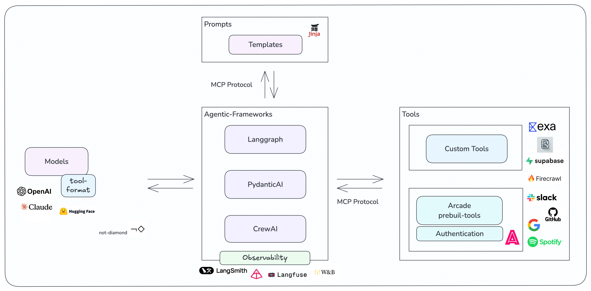

The great AI unbundling is marking a shift from one-size-fits-all solutions to a LEGO-like world where developers can pick the best AI models and tools, mixing and matching components to build systems that perfectly fit their needs.

<!-- more -->

## The Great Unbundling
The year 2023 marked the peak of monolithic AI frameworks. These all-in-one solutions gradually evolved to encompass all AI development needs under a single roof. They were convenient, comprehensive, and, as many teams discovered, increasingly constraining.

Fast forward to the beggining of 2025, and the landscape is increasingly different. Organizations are dismantling these structures in favor of something more flexible: modular ecosystems where each component is interchangeable and best-in-class.

## The Modular Ecosystem

### Core Building Blocks

More and more AI systems are increasingly adopting modular architectures where components connect through standard interfaces. Foundation models serve as the cognitive engine, ranging from general-purpose large language models to specialized models for specific domains or tasks. These models are complemented by a rich ecosystem of tools and integrations that handle everything from data processing to action execution.

The orchestration layer has evolved to support different levels of abstraction, allowing organizations to choose the right balance of control and convenience. High-level orchestrators provide simplified interfaces for common patterns, while low-level frameworks offer granular control over system behavior. This flexibility enables teams to adapt their architecture as their needs evolve.

Today's AI agents are no longer singular towers of functionality. They are built from modular parts—each designed to be interchangeable. These building blocks include:

- **Architectures**: The core design that integrates and connects all components, providing a framework for the agent.
- **Models (LLMs)**: Large language models like those from OpenAI and Anthropic, which provide capabilities for understanding and generating language (and other modalities)
- **Tools and Resources**: Components that extend functionality, from accessing databases to integrating applications and performing actions in the physical world.
- **Prompts**: Configurable inputs that direct models to generate specific outputs, allowing developers to control AI behavior.

This modularity is revolutionizing AI development, allowing developers to swap, upgrade, or fine-tune parts without overhauling entire systems.

### A Common Language

Interoperability protocols are key to making these diverse parts work together. Before such protocols, integrating new models or tools required custom-built solutions. Protocols like Anthropic's Model Context Protocol (MCP) provide a common language for all components to communicate.

With standardized protocols like MCP, adding a new model or replacing an outdated tool becomes straightforward. These protocols reduce friction, allowing developers to innovate and reduce reliance on exclusive integrations. Although MCP is Anthropic-centered, we anticipate more interoperability frameworks like this to emerge in the future.

### The Rise of Marketplaces and Ecosystems

Each building block for LLMs is evolving into a rich marketplace. Language models, tools, and observability frameworks  compete on quality, cost, and features. Developers increasingly have the freedom to mix and match parts without compatibility concerns.

#### LLM Providers

On the LLM provider side, we have tools which allow transparent switching between different LLM providers without any change in the code besides the name of the model. We also have general routers like Not Diamond that help developers dynamically select the best model for the input at hand (even tuned to their specific use case). This also serves to progressively highlight great open-source models that might be highly specialized for specific tasks but aren't widely visible to a wider audience.

#### Tools and prompts

Tools are also moving towards standardized, templated blocks that can be seamlessly integrated into various architectures. This evolution means developers no longer need frameworks with built-in tool support, instead plugging custom agents with tools from diverse providers. Utilities like the Arcade SDK exemplify this trend by allowing devs to effortlessly build custom tooling with built-in authentication, helping users have easy access to utilities like Slack, Calendar or Mail.

On the prompt side, we have several platforms that facilitate the sharing, versioning, and discovery of prompt templates, enabling developers to collaborate and access a diverse array of prompts for various use cases. 

By leveraging tools like these, developers can treat prompts as modular components—starting with high-performing templates and refining them into tailored, use case-specific prompts optimized for their internal evaluation datasets.

#### Observability

In what regards to observability frameworks, many of the most popular ones like Langsmith, W&B Weave, and Langfuse rely on a decorator-based approach, which simplifies their integration to any agent codebase and makes them easily interchangeable.

With decreasing switching costs, developers now have the freedom to choose among a wide array of LLMs, tools, and observability frameworks, using them interchangeably to fit their specific needs. 

### Frameworks

With modular building blocks and standardized protocols, frameworks are evolving from being component integrators to agent orchestrators. These frameworks serve a spectrum of developers, from those seeking simplicity to seasoned developers looking for advanced customization options.

Frameworks like LangGraph provide developers with granular control over AI agent behaviors. LangGraph utilizes a graph-based architecture to define and orchestrate agent workflows, allowing for fine-grained management of task dependencies.

Frameworks like these provide developers with tools to build custom agents for their needs — whether they need a simplified interface or advanced customization.

## Decentralization as the New Norm

The modular approach, enabled by standardized protocols and interchangeable parts, is decentralizing the AI ecosystem. Instead of waiting for each component to be designed for compatibility with their primary framework, developers can freely combine independent pieces from anywhere. This shift from built-in compatibility to universal protocols means innovation happens in parallel - new tools and models can emerge and be adopted immediately without needing for frameworks to catch up.

## Conclusion: Toward modularity

Modular AI ecosystems are transforming the way we build intelligent systems. Teams can select and combine specialized components based on their unique strengths. This shift from monolithic solutions to interchangeable components marks the beginning of truly customizable AI systems.

The path forward isn't without its obstacles. Each additional component introduces latency. Models interpret instructions differently. Systems become harder to test. Yet these challenges pale in comparison to the increased flexibility and iteration speed. As agent systems grow more complex, the ability to mix and match specialized components is less of a luxury and more of a necessity.

### References

# Tools Mentioned in "Toward an Age of Interoperable Agents"

## Model Context Protocol (MCP)
A protocol by Anthropic that provides a common language for AI components to communicate.  
🔗 [Anthropic's Model Context Protocol](https://www.anthropic.com/news/model-context-protocol)

## Not Diamond
An AI model router that dynamically selects the best large language model (LLM) for a given input.  
🔗 [Not Diamond AI Model Router](https://www.notdiamond.ai)

## Arcade SDK
A platform that allows developers to build custom tooling with built-in authentication, facilitating access to utilities like Slack, Calendar, or Mail.  
🔗 [Arcade AI on GitHub](https://github.com/ArcadeAI/arcade-ai)

## LangSmith
A developer platform by LangChain that supports debugging, testing, and monitoring of LLM applications.  
🔗 [LangSmith by LangChain](https://www.langchain.com/langsmith)

## Langfuse
An open-source LLM engineering platform offering observability, analytics, and experimentation features to debug and improve LLM applications.  
🔗 [Langfuse Open-Source LLM Engineering](https://langfuse.com/)

## W&B Weave
A framework by Weights & Biases for tracking, experimenting with, evaluating, deploying, and improving LLM-based applications.  
🔗 [Weave by Weights & Biases](https://weave-docs.wandb.ai/)

## LangGraph
An orchestration framework by LangChain for building stateful, multi-actor applications with LLMs, providing fine-grained control over agent workflows.  
🔗 [LangGraph by LangChain](https://www.langchain.com/langgraph)
