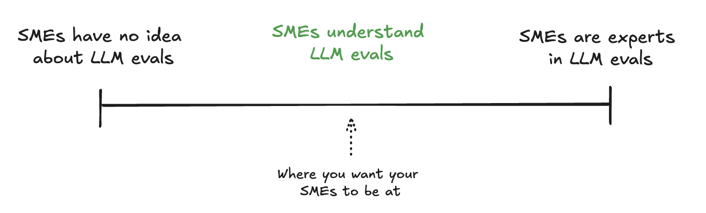

# A Truth Your Domain Experts Can’t Ignore

Want your AI to deliver accurate answers every time? There's a critical element many teams overlook.

A *Ground Truth Dataset* is your foundation for reliable LLM evaluation. While some metrics don't need it, having this human-validated reference data is essential for truly understanding if your AI is performing as intended. Read on to discover why your Subject Matter Experts need to care about Ground Truth, and how to build it right.

<!-- more -->

## Ground Truth is not optional

Let's talk about something that’s often treated as optional, when it really shouldn’t be: *having a solid Ground Truth is as necessary as defining a project roadmap*. 

You wouldn’t kick off a project without knowing what success looks like, so *why would you launch an LLM-based project without knowing what correct answers look like?* 

The Ground Truth is what defines how you want your agent to respond and the specific standards you are aiming for. Without it, how can you measure your progress or even know if your solution is hitting the mark?

#### No vibe check allowed

We've seen many projects where people skip this step because it’s challenging or costly—requiring involvement from subject matter experts (SMEs) and the broader team. But trust me, **building a well-defined Ground Truth dataset is a must from the start**. Yes, it’s resource-intensive, but it’s also foundational. 

Without it, you’re flying blind, relying only on a *vibe check* or intuition about whether the LLM is doing well. And that’s just not enough...

## Ground Truth must be true

So, what does a good Ground Truth look like? When working with SMEs to create a Ground Truth dataset, you should expect them to provide:

1. Essential information elements that must be present in any correct response
2. Acceptable variations in how information can be presented
3. Clear guidelines on tone and style requirements

Given the probabilistic nature of LLMs, we can't expect them to produce identical answers every time. However, your experts should clearly define what constitutes a valid response, including both content requirements and presentation standards. This becomes your Ground Truth - not rigid, word-for-word templates, but rather a comprehensive specification that ensures consistency and accuracy across all responses. 

Let's look at the examples below:

Input prompt: *What are the main features of the premium membership plan?*

- **Poor Ground Truth**: “The premium plan offers lots of great features and benefits that make it a good choice for many users.”
- **Good Ground Truth**: “The premium membership plan provides exclusive benefits, including unlimited access to resources, personalized support, priority booking, and additional discounts on services — designed to enhance your experience at every step!. [Source: Membership Policy Document, Section 3.1]”

## Ground Truth is a joint effort

Starting an LLM project requires defining what the system should and shouldn't do, while planning how to create and validate the Ground Truth data needed to achieve these goals.

**Here's the deal: Your SMEs don't need a PhD in AI** — but they do need to grasp what makes Ground Truth tick. Think of it like teaching someone to drive: they don't need to know how the engine works, but they need to understand the rules of the road. Let's show them exactly how their expertise fits into the bigger picture. 

You should aim to have something like this:

#### It is not a solo SME job

Ground Truth creation is a collaborative process that should involve both SMEs and AI engineers, working together in a well-oiled loop. The SME's role is to provide all the necessary information for a good response, while it's the responsibility of the science team to achieve this in practice. Any updates to the documentation or changes to Ground Truth should be easy to implement across the system. 

## Using Synthetic Data

A tip I’d like to share: if you don’t yet have validated Ground Truth, definitely consider starting with synthetic data. 

Generate questions from your existing documentation and have an LLM provide theoretical answers—these serve as initial synthetic Ground Truths, and is better than having nothing as a reference. 

#### Just a starting point

This approach can be useful for setting up a baseline evaluation suite without relying entirely on SMEs from day one. But remember, **synthetic data is a starting point, not an end goal**. It’s tempting to stick with it, but you need to move on to real Ground Truths validated by SMEs. 

## Avoid These Common Pitfalls

- *Overburdening SMEs*: Don't expect SMEs to become LLM experts. Instead, create structured processes where they focus solely on domain expertise while AI engineers handle technical aspects.

- *Dependence on Synthetic Data*: While synthetic data helps get started, it can introduce biases and make transitioning to human validation difficult. Use it strategically and plan for a gradual shift to human-validated data.

- *Stuck in the Iteration Loop?*: Don't let ground truth updates become a bottleneck! Keep your momentum by using version control, breaking changes into bite-sized pieces, focusing on high-impact updates first.

---

Think of Ground Truth as your LLM project's compass – get it right, and everything else falls into place. Sure, establishing rock-solid Ground Truth might feel like finding true north at first, but every step in the right direction translates directly into an LLM that can be trusted. 

Your future self (and your users!) will thank you for putting in the work today.

