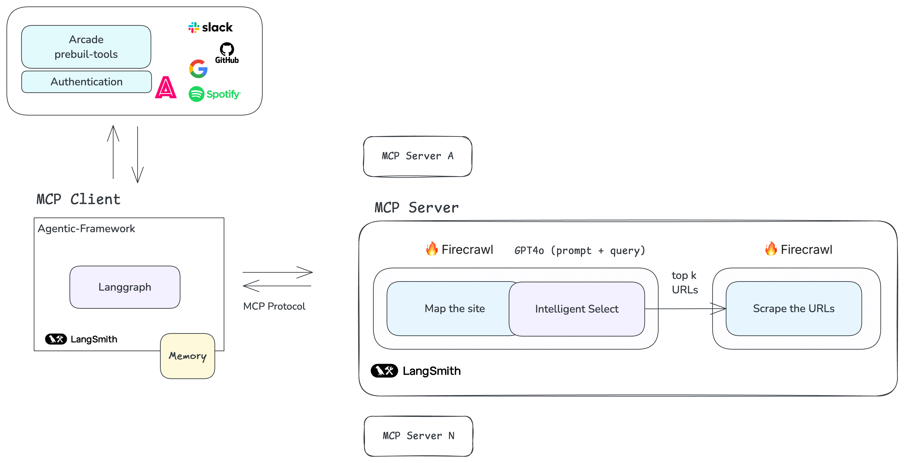

<style>
.md-content {
    text-align: justify;
}
</style>

In this article, I'll take you through the step-by-step process of building an MCP server and connecting it to a custom solution on LangGraph (client).



<!-- more -->

## Introduction

At the last MCP hackathon, I had the opportunity to delve into the Model Context Protocol (MCP), a transformative framework introduced by Anthropic in December 2024. With its flexible and extensible architecture, MCP not only simplifies but also standardizes communication between LLM applications and integrations providing developers with a seamless and efficient foundation for building advanced actors.

## MCP Architecture Overview

MCP operates on a client-server model, offering a robust framework where host applications seamlessly connect to multiple servers.
Like REST standardizes web APIs, MCP is doing the same for LLMs—acting as a translator that bridges and standardizes tools for LLM frameworks/apps.

 - **MCP Hosts**: Applications like Claude Desktop or IDEs that initiate connections. In this article, I'll demonstrate how to integrate a LangGraph solution to act as a client.
 - **MCP Clients**: Protocol clients that manage direct communication with servers.
 - **MCP Servers**: Lightweight programs designed to provide specific capabilities through the standardized protocol. These servers act as "Actors," delivering context, tools, and prompts to clients.


In my opinion, MCP unifies the fragmented ecosystem by solving common developer issues when they want to build agents. It eliminates the need to rewrite code for different languages, like Python and TypeScript, reduces maintenance headaches from adapting tools across frameworks, and saves time on bespoke solutions for integrating tools like scrapers with LLMs. With pre-built integrations, language-agnostic tools, and streamlined connections, MCP makes development faster and more efficient.

Let's dive into the implementation of an MCP server and how to connect it to LangGraph.

## MCP Server Implementation

An example of an MCP server in action is this website researcher service that I built to transform any website into structured, relevant content based on user queries. By combining Firecrawl's mapping, selection, and scraping features with GPT-4's intelligent URL filtering, this server functions as an AI-powered research assistant, predicting and fulfilling user needs effectively.


To achieve this, I implemented the two primary functions: one for defining the schema (`handle_list_tools`) and another for managing the tool's logic (`handle_call_tool`):

```python
server = Server("website_firecrawl_service")

class WebsiteCrawlArgs(BaseModel):
    """
    Arguments for crawling a website
    """
    query: str
    base_url: str
    max_links: int = 100

    model_config = {
        "json_schema_extra": {
            "description": "Arguments for crawling a website"
        }
    }

@server.list_tools()
async def handle_list_tools() -> list[types.Tool]:
    """
    List available tools.
    Each tool specifies its arguments using JSON Schema validation.
    """
    return [
        types.Tool(
            name="website_firecrawl",
            description="Crawl a website",
            inputSchema=WebsiteCrawlArgs.model_json_schema(),
        )
    ]

@server.call_tool()
async def handle_call_tool(
    name: str, arguments: Optional[dict]
) -> List[types.TextContent | types.ImageContent | types.EmbeddedResource]:
    """
    Handle tool execution requests.

    Args:
        name: The name of the tool to execute
        arguments: Dictionary of tool arguments

    Returns:
        List of content items produced by the tool
    """

        if name != "website_firecrawl":
            raise ValueError(f"Unknown tool: {name}")

        if not arguments:
            raise ValueError("Missing arguments")

        args = WebsiteCrawlArgs.model_validate(arguments)

        #The Tool Logic

        return [
            types.TextContent(
                type="text",
                text=response
            )
        ]
```

Then, I just needed to run the server with the following command, and the server would be available to consume from any MCP client:

```bash
uv run website_firecrawl_service
```

You can view the complete implementation in the [MCP Server](https://github.com/lgesuellip/researcher_agent/tree/main/servers) repository. It is compatible with any MCP client you choose, such as Claude Desktop, Langgraph, or any other MCP client.


As shown in the diagram, we can add additional servers to the agent, enabling seamless interactions between them. A good example is the [exa-mcp-server](https://github.com/exa-labs/exa-mcp-server), developed by EXA (Ishan Goswami), which allows performing web searches using EXA Searcher.

Finally, as David Soria Parra (the creator of Model Context Protocol) noted on this [X post](https://x.com/lgesuelli_p/status/1866622405340434490), one MCP server can call another, allowing developers to build sophisticated, layered solutions.

## LangGraph Integration (Client)


To integrate the server that I showed before—or any server of your choice—with LangGraph, a low code agentic framework (the best for complex workflows or fine-grained control :) ), I implemented an abstraction that allows your agents to access MCP tool servers in **just a few lines of code**, allowing developers to add tools, validate inputs, and manage executions with minimal effort:

```python
tools = []
async with LangGraphMCPClient(params) as mcp:
    tools.extend(await mcp.get_tools())
    graph = create_react_agent(ChatOpenAI("gpt-4o"), tools=tools)
```
Additionally, you can integrate it with other ecosystems like ArcadeAI, which has a similar architecture, and enhance our agents with pre-built tools with auth (Google, X, Slack).

```python
tools = []

# Get tools from MCP
async with LanggraphMCPClient(server_params=server_params) as mcp_client:
    tools.extend(await mcp_client.get_tools())
    
     # Get tools from Arcade
    tool_arcade_manager = ArcadeToolManager()
    tools.extend(tool_arcade_manager.get_tools(toolkits=["slack"]))
```

You can find more details here:
 
- The complete LangGraph-MCP integration: [LangGraph MCP Client](https://github.com/lgesuellip/researcher_agent/tree/main/core)
- The core abstraction layer implementation: [LangGraph MCP Manager](https://github.com/lgesuellip/researcher_agent/blob/main/core/clients/langgraph/client.py)

```python
class LanggraphMCPClient(BaseMCPClient):

    def tool_call(self, tool_name: str) -> Any:
        """Create an asynchronous function to call a tool by its name.

        Args:
            tool_name: The name of the tool to be called.

        Returns:
            An asynchronous function that executes the tool with the provided arguments.
        """

        async def tool_function(*args: Any, **kwargs: Any) -> Any:
            result = await self.session.call_tool(tool_name, arguments=kwargs)
            return result
        
        return tool_function

    def wrap_tool(
        self, tool: Any, **kwargs: Any
    ) -> StructuredTool:
        """Wrap a tool as a StructuredTool instance.

        Args:
            tool: The tool object to wrap.
            **kwargs: Additional keyword arguments for tool configuration.

        Returns:
            A StructuredTool instance configured with the provided tool and arguments.
        """

        return StructuredTool.from_function(
            coroutine=self.tool_call(tool.name),
            name=tool.name,
            description=tool.description or "No description provided.",
            args_schema=create_pydantic_model_from_json_schema(tool.name, tool.inputSchema),
        )
```

## Conclusion

In this article, I've shown you how to implement an MCP server and connect it to a custom solution on LangGraph.
Please note that this is an experimental use of LangGraph with MCP and not an official or production-ready implementation (IT NEEDS TESTING and corresponding EVALUATIONS 😊).

To stay updated on MCP's advancements, check out the MCP 2025 Roadmap [here](https://modelcontextprotocol.io/development/roadmap). 

I hope this helps you to understand how MCP works and how you can use it to build your own agents.
I'd love to hear your thoughts—share your experiences in the comments below!